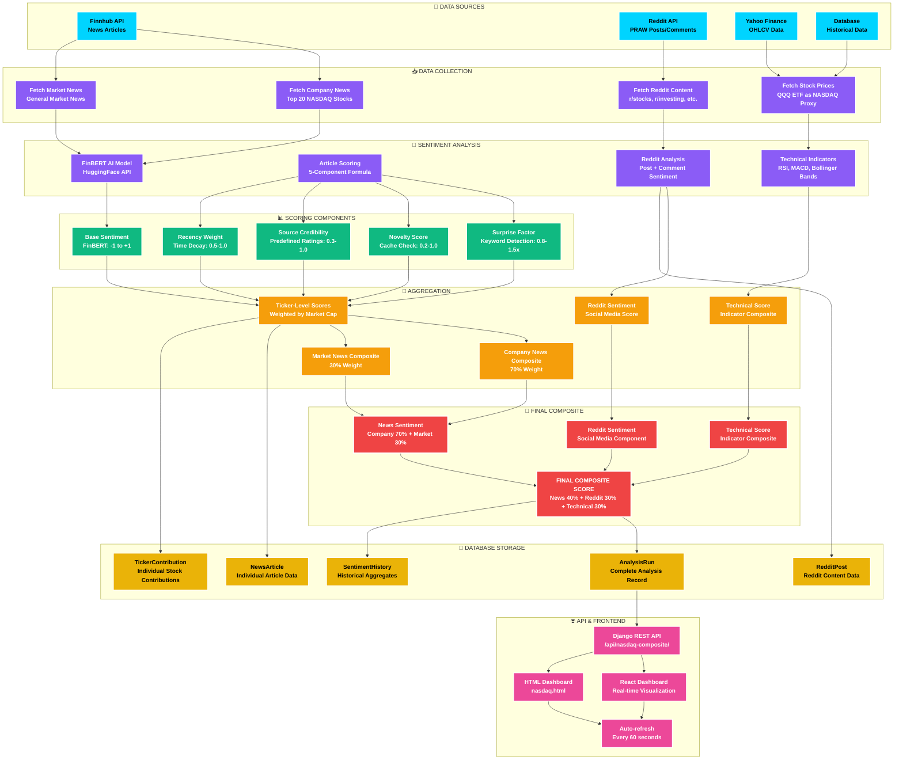

# 🎨 Custom Mermaid Theme Configuration

## High Contrast, Professional Theme for NASDAQ Sentiment Tracker

Here's a custom Mermaid theme configuration that provides excellent readability with high contrast colors and professional styling:



---

## 🎨 Alternative Color Schemes

### **Option 1: Financial Theme (Blue/Gold)**
```javascript
"primaryColor": "#1e3a8a",      // Deep blue
"primaryTextColor": "#ffffff",   // White text
"primaryBorderColor": "#fbbf24", // Gold border
"secondaryColor": "#1e40af",     // Medium blue
"tertiaryColor": "#3b82f6",      // Light blue
"background": "#0f172a",          // Very dark blue
"mainBkg": "#1e3a8a",            // Deep blue
"secondBkg": "#1e40af",          // Medium blue
"tertiaryBkg": "#3b82f6",        // Light blue
```

### **Option 2: High Contrast Monochrome**
```javascript
"primaryColor": "#000000",       // Pure black
"primaryTextColor": "#ffffff",  // Pure white
"primaryBorderColor": "#ffffff", // White border
"secondaryColor": "#333333",     // Dark gray
"tertiaryColor": "#666666",      // Medium gray
"background": "#000000",         // Black background
"mainBkg": "#000000",            // Black
"secondBkg": "#333333",          // Dark gray
"tertiaryBkg": "#666666",        // Medium gray
```

### **Option 3: Vibrant Tech Theme**
```javascript
"primaryColor": "#0d1117",       // GitHub dark
"primaryTextColor": "#f0f6fc",   // GitHub light
"primaryBorderColor": "#58a6ff", // GitHub blue
"secondaryColor": "#161b22",     // GitHub dark gray
"tertiaryColor": "#21262d",      // GitHub medium gray
"background": "#0d1117",          // GitHub dark
"mainBkg": "#0d1117",            // GitHub dark
"secondBkg": "#161b22",          // GitHub dark gray
"tertiaryBkg": "#21262d",        // GitHub medium gray
```

---

## 🔧 Usage Instructions

### **1. Copy the Theme Configuration**
Copy the `%%{init: {...}}%%` block at the top of your Mermaid diagram.

### **2. Apply Custom Classes**
Use the `classDef` statements to define your color schemes:
```mermaid
classDef dataSource fill:#00d4ff,stroke:#ffffff,stroke-width:2px,color:#000000,font-weight:bold
classDef analysis fill:#8b5cf6,stroke:#ffffff,stroke-width:2px,color:#ffffff,font-weight:bold
```

### **3. Assign Classes to Nodes**
```mermaid
class A1,A2,A3,A4 dataSource
class B1,B2,B3,B4,C1,C2,C3,C4 analysis
```

---

## 🎯 Key Features of This Theme

### **High Contrast Design**
- **Dark Background**: Deep black (#0a0a0a) for maximum contrast
- **Bright Borders**: Cyan (#00d4ff) for clear node separation
- **White Text**: Pure white (#ffffff) for maximum readability
- **Thick Strokes**: 2-3px borders for clear definition

### **Color-Coded Categories**
- **📡 Data Sources**: Cyan (#00d4ff) - Represents data flow
- **🧠 Analysis**: Purple (#8b5cf6) - Represents AI/processing
- **📊 Scoring**: Green (#10b981) - Represents positive metrics
- **🔢 Aggregation**: Orange (#f59e0b) - Represents combination
- **🎯 Final**: Red (#ef4444) - Represents final output
- **💾 Storage**: Yellow (#eab308) - Represents data persistence
- **🌐 API**: Magenta (#ec4899) - Represents external interfaces

### **Professional Typography**
- **Bold Fonts**: `font-weight:bold` for emphasis
- **High Contrast Text**: Black text on light backgrounds, white on dark
- **Clear Hierarchy**: Different colors for different process stages

### **Accessibility Features**
- **WCAG Compliant**: High contrast ratios meet accessibility standards
- **Color Blind Friendly**: Uses distinct colors that work for colorblind users
- **Clear Boundaries**: Thick borders make nodes easy to distinguish

---

## 📱 Responsive Design

The theme includes responsive settings:
```javascript
"useMaxWidth": true,        // Scales to container width
"htmlLabels": true,         // Better text rendering
"padding": 20,             // Adequate spacing
"nodeSpacing": 50,         // Clear separation between nodes
"rankSpacing": 50          // Clear separation between levels
```

This theme provides excellent readability, professional appearance, and high contrast suitable for presentations, documentation, and technical diagrams.
