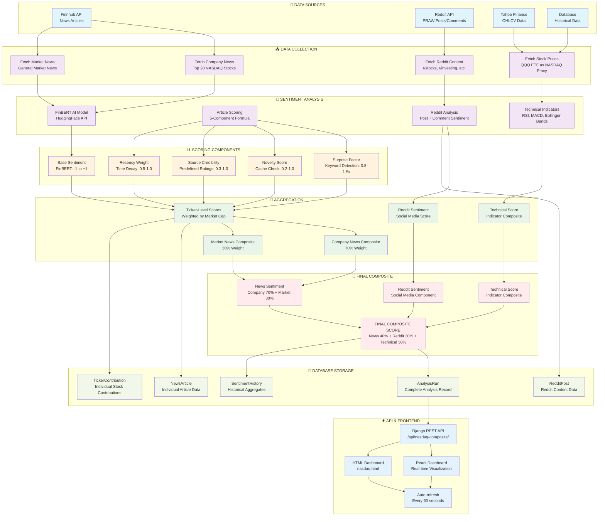

# 📊 NASDAQ Sentiment Tracker - Complete System Workflow

## 🎯 System Overview

The NASDAQ Sentiment Tracker is a comprehensive sentiment analysis system that combines **News Sentiment**, **Reddit/Social Media Sentiment**, and **Technical Indicators** to create a unified composite sentiment score for the NASDAQ market.

---

## 🔄 Complete Workflow Diagram



---

## 🔍 Detailed Process Breakdown

### **Phase 1: Data Collection** 📥

#### **1.1 Company News Collection**
```python
# Fetch news for top 20 NASDAQ stocks
NASDAQ_TOP_20 = {
    'AAPL': 0.143, 'MSFT': 0.125, 'NVDA': 0.101, 'GOOGL': 0.085,
    'AMZN': 0.075, 'TSLA': 0.065, 'META': 0.055, 'GOOG': 0.045,
    # ... 12 more stocks
}

for ticker in NASDAQ_TOP_20:
    news = finnhub_client.company_news(ticker, lookback_hours=24)
    # Process top 10 articles per ticker
```

#### **1.2 Market News Collection**
```python
# Fetch general market news
market_news = finnhub_client.general_news('general')
# Filter for market-moving keywords
relevant_news = filter_market_moving_news(market_news)
```

#### **1.3 Reddit Content Collection**
```python
# Fetch from multiple subreddits
subreddits = ['stocks', 'investing', 'StockMarket', 'wallstreetbets']
reddit_content = fetch_all_reddit_content(subreddits)
# Filter for NASDAQ-related content
```

#### **1.4 Stock Price Data**
```python
# Use QQQ ETF as NASDAQ proxy
ohlcv = fetch_latest_ohlcv_from_yfinance('QQQ', interval='1m')
# Get OHLCV: Open, High, Low, Close, Volume
```

---

### **Phase 2: Sentiment Analysis** 🧠

#### **2.1 FinBERT AI Analysis**
```python
def analyze_sentiment_finbert_api(text):
    # Send to HuggingFace FinBERT model
    response = requests.post(API_URL, json={"inputs": text[:512]})
    result = response.json()
    
    # Extract sentiment scores
    sentiment_map = {'positive': 0, 'negative': 0, 'neutral': 0}
    for item in result[0]:
        sentiment_map[item['label'].lower()] = item['score']
    
    # Calculate final score: positive - negative
    return sentiment_map['positive'] - sentiment_map['negative']
```

#### **2.2 Article Scoring Formula**
```python
def calculate_article_score(article):
    # 5-component scoring system
    article_score = (
        base_sentiment * 0.40 * 100 +           # 40% weight
        (surprise_factor - 1) * 0.25 * 50 +     # 25% weight  
        novelty_score * 0.15 * 30 +             # 15% weight
        source_credibility * 0.10 * 20 +         # 10% weight
        recency_weight * 0.10 * 20               # 10% weight
    )
    return article_score
```

#### **2.3 Component Calculations**

**Base Sentiment** (40% weight):
- FinBERT AI model analysis
- Range: -1.0 to +1.0
- Example: "Apple beats earnings" → +0.75

**Surprise Factor** (25% weight):
- Keyword detection for unexpected news
- Range: 0.8x to 1.5x multiplier
- Keywords: "unexpected", "surprise", "shock", "beats", "misses"

**Novelty Score** (15% weight):
- Cache check for duplicate articles
- Range: 0.2 to 1.0
- New article: 1.0, Cached: 0.2

**Source Credibility** (10% weight):
- Predefined ratings for news sources
- Range: 0.3 to 1.0
- Bloomberg: 1.0, Reuters: 1.0, Unknown: 0.5

**Recency Weight** (10% weight):
- Time decay based on article age
- Range: 0.5 to 1.0
- < 1 hour: 1.0, > 24 hours: 0.5

---

### **Phase 3: Aggregation** 🔢

#### **3.1 Ticker-Level Aggregation**
```python
# For each stock (e.g., AAPL)
ticker_sentiment = average(article_scores)  # Average of top 10 articles
weighted_contribution = ticker_sentiment * market_cap_weight

# Example:
# AAPL sentiment: +35.0
# AAPL weight: 14.3%
# Contribution: +35.0 × 0.143 = +5.0
```

#### **3.2 News Composite Calculation**
```python
# Current formula (70/30 split)
news_composite = (
    company_sentiment * 0.70 +    # Weighted average of 20 stocks
    market_sentiment * 0.30       # General market news
)
```

#### **3.3 Reddit Sentiment Analysis**
```python
def analyze_reddit_content_batch(posts, comments):
    # Analyze posts with FinBERT
    post_sentiments = analyze_sentiment_finbert_batch(post_texts)
    
    # Calculate Reddit-specific factors
    for post in posts:
        recency_weight = calculate_recency_weight(post['created_utc'])
        novelty_score = calculate_novelty_score(post['score'], post['num_comments'])
        source_credibility = get_subreddit_credibility(post['subreddit'])
        
        post_score = base_sentiment * 100 * novelty_score * source_credibility
    
    # Average all post scores
    reddit_composite = average(post_scores)
    return reddit_composite
```

#### **3.4 Technical Indicators**
```python
def calculate_technical_composite_score(indicators):
    # Convert technical indicators to sentiment-like score
    rsi_score = calculate_rsi_sentiment(indicators['rsi_14'])
    macd_score = calculate_macd_sentiment(indicators['macd_histogram'])
    bb_score = calculate_bollinger_sentiment(indicators['bb_upper'], 
                                           indicators['bb_lower'], 
                                           current_price)
    
    # Weighted average of technical indicators
    technical_score = (
        rsi_score * 0.30 +
        macd_score * 0.30 +
        bb_score * 0.20 +
        ma_crossover_score * 0.20
    )
    
    return technical_score  # Range: -100 to +100
```

---

### **Phase 4: Final Composite Score** 🎯

#### **4.1 New Composite Formula (Planned)**
```python
# Target formula from implementation plan
final_composite_score = (
    news_sentiment * 0.40 +        # News analysis (40%)
    reddit_sentiment * 0.30 +     # Social media (30%)
    technical_score * 0.30         # Technical indicators (30%)
)
```

#### **4.2 Current Implementation**
```python
# Current formula (news-only)
final_composite_score = (
    company_sentiment * 0.70 +    # Company news (70%)
    market_sentiment * 0.30       # Market news (30%)
)

# Reddit sentiment tracked separately
reddit_sentiment = analyze_reddit_content_batch(posts, comments)
```

---

### **Phase 5: Database Storage** 💾

#### **5.1 AnalysisRun Model**
```python
class AnalysisRun(models.Model):
    # Core sentiment data
    composite_score = models.FloatField()  # Final score (-100 to +100)
    sentiment_label = models.CharField()  # BULLISH, NEUTRAL, BEARISH
    
    # Component averages
    avg_base_sentiment = models.FloatField()
    avg_surprise_factor = models.FloatField()
    avg_novelty = models.FloatField()
    avg_source_credibility = models.FloatField()
    avg_recency_weight = models.FloatField()
    
    # Stock price data
    stock_price = models.DecimalField()
    price_change_percent = models.FloatField()
    
    # Technical indicators
    rsi_14 = models.FloatField()
    macd = models.FloatField()
    macd_histogram = models.FloatField()
    bb_upper = models.FloatField()
    bb_middle = models.FloatField()
    bb_lower = models.FloatField()
    sma_20 = models.FloatField()
    sma_50 = models.FloatField()
    
    # Reddit sentiment
    reddit_sentiment = models.FloatField()
    reddit_posts_analyzed = models.IntegerField()
    reddit_comments_analyzed = models.IntegerField()
```

#### **5.2 Supporting Models**
- **NewsArticle**: Individual article data with sentiment scores
- **RedditPost**: Reddit content with sentiment analysis
- **TickerContribution**: Individual stock contributions to composite
- **SentimentHistory**: Daily aggregated historical data

---

### **Phase 6: API & Frontend** 🌐

#### **6.1 Django REST API Endpoints**
```python
# Main endpoints
/api/nasdaq-composite/          # Latest composite score
/api/nasdaq-historical/         # Historical data for charts
/api/ticker-analysis/{symbol}/  # Individual ticker analysis
/api/analysis-run-contributions/{id}/  # Ticker contributions
```

#### **6.2 Frontend Dashboards**
- **React Dashboard**: Real-time visualization with auto-refresh
- **HTML Dashboard**: Standalone nasdaq.html with Chart.js
- **Auto-refresh**: Updates every 60 seconds

---

## 🔄 Execution Flow

### **Continuous Monitoring Mode**
```python
# Run every 5 minutes (300 seconds)
while True:
    # 1. Check for new articles
    has_new_articles = check_for_new_content()
    
    if has_new_articles:
        # Full analysis with new content
        run_nasdaq_composite_analysis()
    else:
        # Price-only update (faster)
        update_price_and_technical_indicators()
    
    # Wait for next interval
    time.sleep(300)
```

### **Single Run Mode**
```python
# Run once and exit
python manage.py run_nasdaq_sentiment --once
```

---

## 📊 Data Flow Summary

1. **Data Sources** → **Collection** → **Analysis** → **Scoring** → **Aggregation** → **Composite** → **Storage** → **API** → **Frontend**

2. **Three Main Sentiment Drivers**:
   - **News Sentiment**: FinBERT analysis of financial news (70% weight)
   - **Reddit Sentiment**: Social media sentiment analysis (tracked separately)
   - **Technical Indicators**: RSI, MACD, Bollinger Bands (tracked separately)

3. **Final Composite Score**: Combines all three drivers with planned 40/30/30 weighting

4. **Real-time Updates**: Continuous monitoring with 5-minute intervals

5. **Caching**: Intelligent caching prevents re-analysis of duplicate content

---

## 🎯 Key Features

- **Multi-source Analysis**: News, Social Media, Technical Indicators
- **AI-Powered**: FinBERT financial language model
- **Market Cap Weighted**: Larger stocks have more influence
- **Real-time**: Continuous monitoring and updates
- **Caching**: Efficient duplicate detection and storage
- **Scalable**: Batch processing for API efficiency
- **Comprehensive**: Full historical tracking and analysis

This system provides a complete, real-time sentiment analysis solution for the NASDAQ market, combining traditional financial analysis with modern AI and social media insights.
